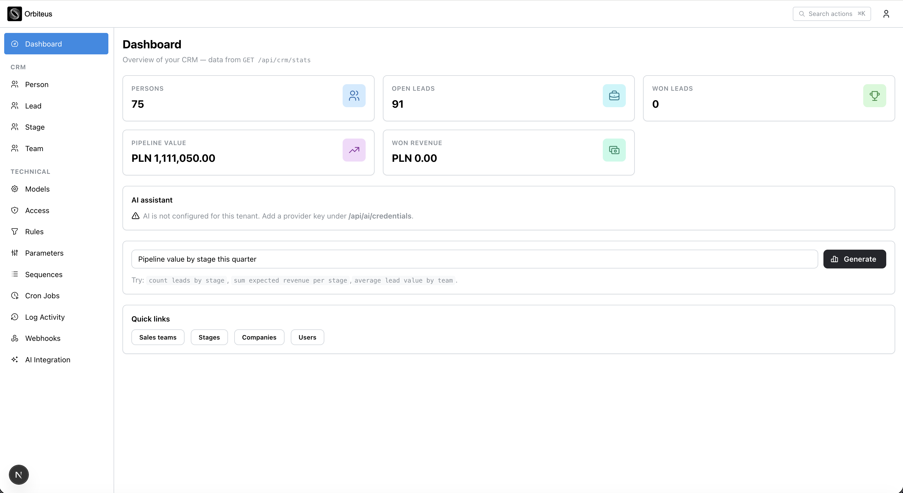
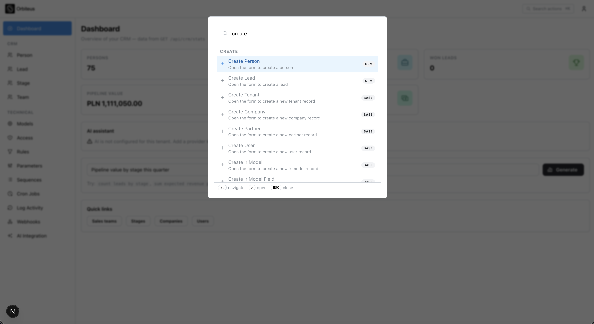
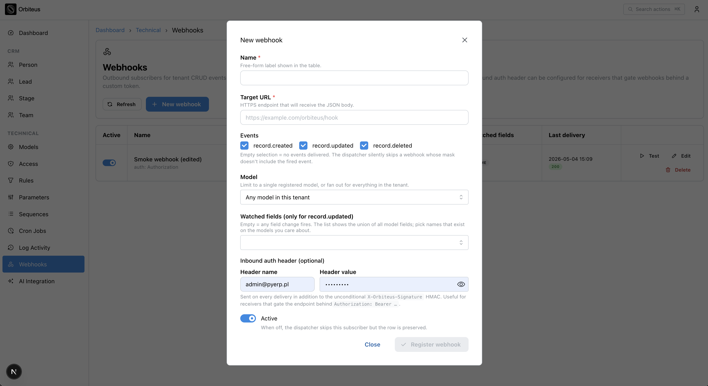
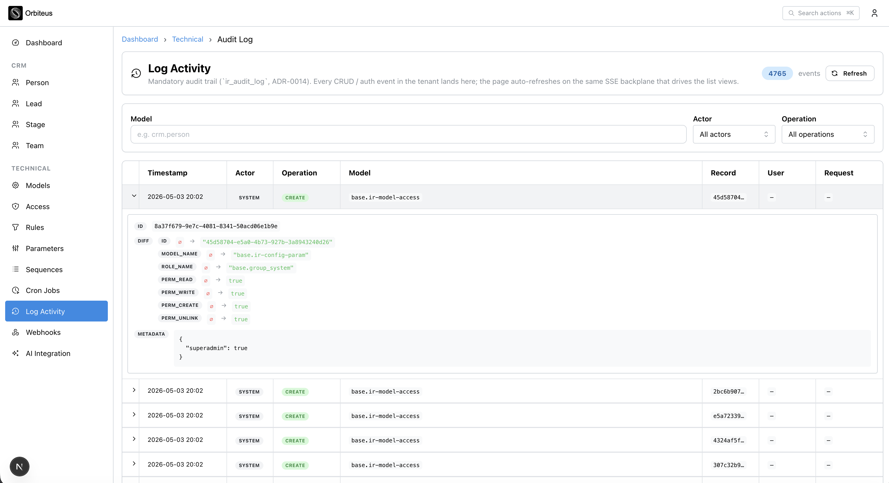
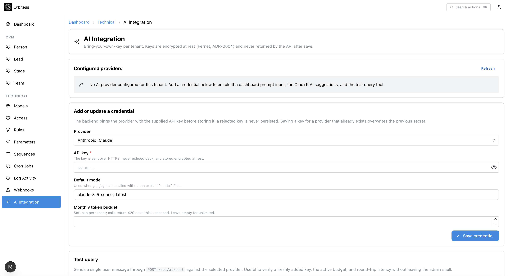

<div align="center">
  <a href="https://orbiteus.com">
    
  </a>

  <!-- LOCKED: README hero tagline — do not edit without explicit product-owner approval (see AGENTS.md). -->
  **Orbiteus — A Full-Stack Development Framework for AI Agents. Build custom ERP, CRM & Business Tools in days not months. Start with 80% of the job done.**

  
  
  
  
  
  
</div>

> **AI agents** touching this repository: read [`docs/pre-prompt.md`](docs/pre-prompt.md) first. It is the canonical stack and convention contract. Skipping it leads to invented dependencies and bypassed framework primitives — both out of bounds.

---

## What is Orbiteus?

Orbiteus is **not a product** — it's a **platform for building products**.

You install the engine, configure modules, brand the UI, and get **your own** business application — shaped around **your** processes, not the other way around.

## What you can build with Orbiteus

- **Gym chain management** (members, contracts, trainers)
- **Interior design studio** (projects, suppliers, subcontractors)
- **Transport management system (TMS)**
- **Niche CRM SaaS** for any vertical
- **Warehouse management (WMS)**
- **Any combination of the above**

The hero line is literal: **80% of the plumbing is already there** — auth, tenants, permissions, audit, APIs, admin UI, jobs, realtime, and **AI agents** calling tools under the same rules as people. You sell the **20%** that is your market: members, loads, studio phases, stock moves — not another hand-rolled session stack or webhook retry loop.

---

## Screenshots

Files: [`docs/assets/readme-screenshots/`](docs/assets/readme-screenshots/) (`1.png`–`5.png`). Swap files there to refresh the gallery.

|  |  |
|:---:|:---:|
| **1.** Admin dashboard — CRM KPIs, AI assistant, CRM + Technical nav. | **2.** Command palette (`⌘K`) — create records across modules from one search. |

|  |  |
|:---:|:---:|
| **3.** Webhooks — outbound events, target URL, optional auth headers. | **4.** Audit log — tenant-wide trail with filters and field-level diffs. |

|  |
|:---:|
| **5.** AI integration — BYOK provider keys, models, per-tenant token budget. |

---

## Capabilities (proof, not philosophy)

| | |
|---|---|
| **Modular monolith** | `registry.register("your_module")` wires models, security, views, actions, and optional AI surface in one place. |
| **Zero TSX per business module** | Catch-all admin routes + widget registry + view XML — new tables and APIs ship with matching UI patterns. |
| **Multi-tenant by default** | Repository-enforced tenancy; negative tests for cross-tenant access. |
| **Layered RBAC** | Model access, record rules, actions, and AI scopes; Redis-backed cache with cross-replica invalidation. |
| **Audit** | CRUD, auth events, AI tool calls — with redaction hooks for sensitive payloads. |
| **Events, outbox, webhooks** | Atomic outbox rows, Celery workers, bounded retries, dead-letter path, HMAC-signed delivery. |
| **Realtime** | SSE + Redis Pub/Sub; tenant-scoped topics; admin lists and portal views can subscribe safely. |
| **Infra in one command** | Docker Compose: Postgres 16 + pgvector, Redis, backend, admin UI, portal UI (see [`docs/17-deployment.md`](docs/17-deployment.md)). |
| **CI gate** | Docs checks, pytest + coverage, Vitest, `next build`, Playwright, audits, secrets baseline, license policy. |

---

## Quick start

```bash
git clone <repo-url>
cd orbiteus
docker compose up --build
```

| Surface | URL |
|--------|-----|
| Admin UI | http://localhost:3000 |
| Portal UI | http://localhost:3001 (dev compose; prod uses reverse proxy — see deployment docs) |
| API | http://localhost:8000/api |
| OpenAPI | http://localhost:8000/api/docs |
| Metrics | http://localhost:8000/metrics |

Default login (development only): `admin@example.com` / `admin1234`.  
Rotate `BOOTSTRAP_ADMIN_PASSWORD` and `SECRET_KEY` before any production traffic — the production profile refuses default secrets.

---

## Architecture at a glance

```
+---------------------------+     +---------------------------+
|   admin-ui (Next.js 16)   |     |   portal-ui (Next.js 16)  |
|   internal users (RBAC)   |     |   external users / share  |
+-------------+-------------+     +-------------+-------------+
              |  /api/*  (admin-ui: server proxy; portal: rewrites + same-origin)|
              v          v                       v            v
+------------------------------------------------------------------+
|  FastAPI (Gunicorn + UvicornWorker in production)               |
|  orbiteus_core: registry, repositories, auto-router, AI,        |
|                 auth, RBAC, audit, events, cache, realtime       |
|  modules:       base, auth, crm (reference sample), …          |
+----------+----------------------+--------------------+-----------+
           |                      |                    |
+----------v---------+  +---------v--------+  +--------v---------+
|  PostgreSQL 16     |  |  Redis 7         |  |  Celery 5        |
|  + pgvector        |  |  cache, pub/sub, |  |  + Beat          |
|  (+ PgBouncer)     |  |  rate limits,   |  |  outbox drain    |
+--------------------+  |  session revoke  |  |  + webhooks       |
                        +------------------+------------------+
```

---

## What ships in the box (summary)

For the full checklist against the internal Definition of Done, see [`docs/34-inventory-and-status.md`](docs/34-inventory-and-status.md) and [`CHANGELOG.md`](CHANGELOG.md). In one breath:

- **Identity & sessions** — JWT access/refresh with rotation, TOTP + recovery codes, password reset flow, HttpOnly cookie session for the admin shell, share tokens for portal.
- **Data & rules** — Async SQLAlchemy 2, Alembic, soft delete hooks, attribution columns, record rules, strict tenant filters on repositories.
- **AI** — Provider adapters (Anthropic, OpenAI, Ollama), BYOK storage, streaming chat, tool dispatcher, embeddings table with pgvector.
- **Ops** — Structured logs, Prometheus metrics families, optional OpenTelemetry, backup scripts and restore-drill documentation.
- **Quality gate** — GitHub Actions workflow aggregating docs, tests, audits, and license reports.

---

## For engineers (stack & modules)

### Tech stack (authoritative detail)

Binding list lives in [`docs/pre-prompt.md`](docs/pre-prompt.md) (stack section). In short: Python 3.13, FastAPI, SQLAlchemy 2 + asyncpg, Pydantic v2, Redis, Celery 5, PostgreSQL 16 + pgvector, Next.js 16 + React 19 + Mantine 9.

**Monorepo (npm workspaces):** `admin-ui` and `portal-ui` only. Cross-cutting widgets and AI surfaces (`PromptInput`, `AIDashboard`, shared form widgets) live under **`admin-ui/src/orbiteus-ui/`**. When the portal needs the same UX, copy the relevant files into `portal-ui` (two deployable apps, no separate `packages/*` workspace).

### Module layout

Full convention: [`docs/03-modules.md`](docs/03-modules.md). Skeleton:

```
modules/<name>/
  manifest.py
  model/domain.py, mapping.py, schemas.py
  controller/repositories.py, services.py, router.py
  security/access.yaml
  view/*.xml, config.py
  actions.py, ai.py, bootstrap.py, docs/spec.md
```

Register once:

```python
registry.register("your_module")
```

You get migrations against declared tables, REST + OpenAPI for each model, dynamic list/form/kanban/calendar/graph, Command Palette actions, AI tool surface, audit, RBAC, and realtime hooks — without copying CRUD from another module.

### Running tests

```bash
# backend
PYTHONPATH=backend pytest -q --cov --cov-report=term

# admin UI unit tests
npm test --workspace admin-ui

# Playwright (stack on :3000)
npm run e2e --workspace admin-ui
```

Details: [`docs/20-testing.md`](docs/20-testing.md) and `.github/workflows/ci.yml`.

---

## Documentation map

| Topic | File |
|-------|------|
| Pre-prompt (read first) | [`docs/pre-prompt.md`](docs/pre-prompt.md) |
| Architecture | [`docs/02-architecture.md`](docs/02-architecture.md) |
| Modules | [`docs/03-modules.md`](docs/03-modules.md) |
| Data model + `ir_*` | [`docs/04-data-model.md`](docs/04-data-model.md) |
| RBAC + multi-tenancy | [`docs/05-rbac-multitenancy.md`](docs/05-rbac-multitenancy.md) |
| Auth | [`docs/06-auth.md`](docs/06-auth.md) |
| Auto-CRUD API + webhooks | [`docs/07-api.md`](docs/07-api.md) |
| Admin UI | [`docs/08-admin-ui.md`](docs/08-admin-ui.md) |
| Design system (Mantine + `orbiteus-ui`) | [`docs/10-design-system.md`](docs/10-design-system.md) |
| Portal UI | [`docs/09-portal-ui.md`](docs/09-portal-ui.md) |
| Realtime | [`docs/11-realtime.md`](docs/11-realtime.md) |
| Events + queues | [`docs/12-events-and-queues.md`](docs/12-events-and-queues.md) |
| Audit | [`docs/14-audit.md`](docs/14-audit.md) |
| AI layer | [`docs/15-ai-layer.md`](docs/15-ai-layer.md) |
| Deployment | [`docs/17-deployment.md`](docs/17-deployment.md) |
| Security | [`docs/18-security.md`](docs/18-security.md) |
| Testing | [`docs/20-testing.md`](docs/20-testing.md) |
| Observability | [`docs/29-observability.md`](docs/29-observability.md) |
| Backups + DR | [`docs/31-backups-and-dr.md`](docs/31-backups-and-dr.md) |
| Inventory ledger | [`docs/34-inventory-and-status.md`](docs/34-inventory-and-status.md) |
| Definition of Done | [`docs/35-core-definition-of-done.md`](docs/35-core-definition-of-done.md) |
| ADRs | [`docs/adr/`](docs/adr/) |

---

## Contributing

We welcome fixes, docs, and modules that follow the registry contract. Start with [`CONTRIBUTING.md`](CONTRIBUTING.md) (branching, review expectations, and the PR checklist) and [`AGENTS.md`](AGENTS.md) for automation policy.

---

## Versioning + release

Current line is **`v1.0.0`**. Release notes: [`CHANGELOG.md`](CHANGELOG.md). Honest code-vs-docs progress: [`docs/34-inventory-and-status.md`](docs/34-inventory-and-status.md).

---

## License

MIT — see [`LICENSE`](LICENSE). Third-party manifests: [`THIRD_PARTY_LICENSES.python.json`](THIRD_PARTY_LICENSES.python.json), [`THIRD_PARTY_LICENSES.node.json`](THIRD_PARTY_LICENSES.node.json) (regenerated via `scripts/generate_licenses.sh`; CI enforces a no-GPL policy with a small compatibility allow-list — see `docs/27-licenses.md`).
