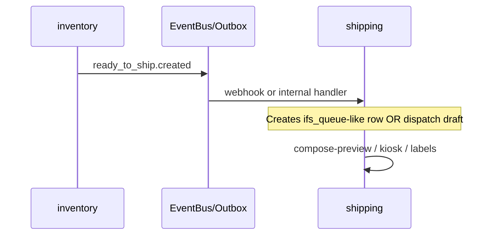

# Module: inventory — Warehouse Management System (WMS)

> **Layer:** product  
> **depends_on:** [base, auth]  
> **Status:** specification v0.1 — **WMS-001..015** (see [`tasks.md`](./tasks.md))  
> **Authority:** Ekspert B — [`../shipping/docs/wms-audit.md`](../shipping/docs/wms-audit.md) (tabela WMS + checklist tier-1)  
> **Governance:** [ADR-0018](../../../docs/adr/0018-shipping-pack-station-not-wms.md)  
> **Out of scope:** carrier labels, IFS webhook, TMS (`shipping` module)

## Purpose

Close the **Expert B gap** between Orbiteus (**2,4/10** as WMS) and a **mid-market / tier-1-capable**
WMS built on the same engine as CRM and shipping:

| Audyt B — obszar | Tier-1 | Orbiteus dziś | Target modułu `inventory` |
|------------------|--------|---------------|---------------------------|
| Lokalizacje / bin / slotting | 10 | 1 | **WMS-001** → 8 |
| Stan / rezerwacje | 10 | 1 | **WMS-002..004** → 8 |
| Przyjęcia / ASN / putaway | 10 | 1 | **WMS-005..006** → 7 |
| Kompletacja / fale / pick path | 10 | 1 | **WMS-007..009** → 7 |
| Inwentaryzacja | 9 | 1 | **WMS-010** → 7 |
| Lot / serial | 9 | 1 | **WMS-011** → 6 (v1.1) |
| Integracja ERP | 8 | 7 (shipping/IFS) | **WMS-012** event bus |
| Analityka WMS | 9 | 3 | **WMS-013** → 6 |
| Labor / WES | 8 | 2 | **WMS-014** → 5 (v2) |
| Yard / dock | 8 | 1 | **WMS-015** → 4 (v2) |

**Pack / etykiety / manifest załadunku** pozostają w `shipping` (Expert A, **6,8→8/10**).

## Design principles (Orbiteus)

1. **Module boundary** — `inventory.*` owns stock truth; `shipping.*` owns labels. Handoff tylko przez **event + UUID**.
2. **No cross-module imports** — `order_id`, `shipment_id`, `product_id` jako UUID FK; zero `from modules.shipping...`.
3. **RBAC + audit** — każdy ruch magazynowy przez `BaseRepository`.
4. **Moves as ledger** — `inventory.move` jest księgą; `inventory.quant` to materialized on-hand (odwracalne przez move, nie direct edit).
5. **RF-first API** — każda operacja hali ma endpoint „scan confirm” (JSON), UI później.
6. **Boring tech** — Postgres, Celery na długie przeliczenia (reeval quant), bez WCS w v1.

## Parity with CRM / shipping module layout

```
modules/inventory/
  manifest.py
  model/domain.py
  model/mapping.py
  model/schemas.py
  controller/repositories.py
  controller/services.py
  controller/router.py
  security/access.yaml
  view/*.xml
  actions.py
  ai.py
  bootstrap.py
  docs/spec.md
  docs/tasks.md
```

Dedicated admin-ui components only where dynamic renderer fails (RF scan shell, pick cart) —
pattern: `admin-ui/src/components/inventory/*`.

---

## Feature map (WMS-001..015)

| ID | Feature | Expert B driver | MVP wave |
|----|---------|-----------------|----------|
| WMS-001 | Location tree (warehouse → bin) | Lokalizacje 1→8 | **1** |
| WMS-002 | Product / SKU master (`inventory.product`) | Master data | **1** |
| WMS-003 | On-hand (`inventory.quant`) | Stan 1→8 | **1** |
| WMS-004 | Stock moves (receipt, transfer, adjustment) | Stan + audit trail | **1** |
| WMS-005 | Reservations / soft allocation | Rezerwacje | **2** |
| WMS-006 | Receiving + ASN lines | Przyjęcia 1→7 | **3** |
| WMS-007 | Putaway tasks | Putaway | **3** |
| WMS-008 | Pick waves + pick lists | Kompletacja 1→7 | **4** |
| WMS-009 | Pick confirm (scan SKU + bin + qty) | RF / pick path | **4** |
| WMS-010 | Cycle count | Inwentaryzacja 1→7 | **5** |
| WMS-011 | Lot / serial (optional trace) | Lot/serial 1→6 | **6** |
| WMS-012 | Ready-to-ship → `shipping` handoff | Integracja outbound | **5** |
| WMS-013 | WMS KPI API (fill rate, pick rate) | Analityka 3→6 | **5** |
| WMS-014 | Labor task queue (basic) | Labor 2→5 | **7** |
| WMS-015 | Dock appointments (skeleton) | Yard 1→4 | **7** |

---

## Domain model

### WMS-001 — `inventory.warehouse`

| Field | Type | Notes |
|-------|------|--------|
| `code` | str | unique per tenant |
| `name` | str | |
| `address_json` | JSONB | optional |

### `inventory.location`

Hierarchical bins: `parent_id`, `location_type` ∈ `warehouse|zone|aisle|rack|bin|dock|staging`.

| Field | Type | Notes |
|-------|------|--------|
| `warehouse_id` | UUID FK | |
| `parent_id` | UUID FK nullable | tree |
| `code` | str | e.g. `BAZ-A-12-03` |
| `name` | str | |
| `location_type` | str | |
| `is_pickable` | bool | |
| `is_receivable` | bool | |
| `max_weight_kg` | float | optional capacity |
| `barcode` | str | unique per warehouse — scan key |

### WMS-002 — `inventory.product`

| Field | Type | Notes |
|-------|------|--------|
| `sku` | str | unique per tenant |
| `name` | str | |
| `barcode` | str | EAN |
| `uom` | str | `pcs`, `kg`, … |
| `weight_kg` | float | |
| `is_lot_tracked` | bool | WMS-011 |
| `is_serial_tracked` | bool | WMS-011 |

### WMS-003 — `inventory.quant`

On-hand balance **per product + location** (+ optional lot).

| Field | Type | Notes |
|-------|------|--------|
| `product_id` | UUID FK | |
| `location_id` | UUID FK | |
| `lot_id` | UUID FK nullable | WMS-011 |
| `quantity` | numeric | available |
| `reserved_quantity` | numeric | WMS-005 |
| `incoming_quantity` | numeric | from open receipts |

Unique: `(tenant, product_id, location_id, lot_id)`.

### WMS-004 — `inventory.move`

Immutable ledger line (double-entry style: from_location → to_location).

| Field | Type | Notes |
|-------|------|--------|
| `move_type` | enum | `receipt|transfer|pick|ship|adjust|count` |
| `state` | enum | `draft|confirmed|cancelled` |
| `product_id` | UUID FK | |
| `quantity` | numeric | |
| `from_location_id` | UUID nullable | |
| `to_location_id` | UUID nullable | |
| `reference` | str | external doc no |
| `origin_model` | str | e.g. `inventory.receipt` |
| `origin_id` | UUID | |

Confirmed move updates `quant` in same transaction.

### WMS-005 — `inventory.reservation`

| Field | Type | Notes |
|-------|------|--------|
| `product_id` | UUID | |
| `quantity` | numeric | |
| `order_id` | UUID nullable | FK orders — no import |
| `state` | enum | `draft|assigned|released|consumed` |
| `priority` | int | |

### WMS-006 — `inventory.receipt` + `inventory.receipt_line`

ASN / przyjęcie.

| Model | Role |
|-------|------|
| `receipt` | Header: supplier ref, expected date, state `draft|in_progress|done` |
| `receipt_line` | product, qty expected, qty received |

### WMS-007 — `inventory.putaway_task`

| Field | Notes |
|-------|--------|
| `receipt_line_id` | source |
| `from_location_id` | staging/dock |
| `to_location_id` | proposed bin (slotting rules v1: manual) |
| `state` | `open|done|cancelled` |

### WMS-008 — `inventory.pick_wave` + `inventory.pick_list` + `inventory.pick_line`

| Model | Role |
|-------|------|
| `pick_wave` | Batch outbound, cut-off time, state |
| `pick_list` | Assigned to user / cart |
| `pick_line` | product, from_location, qty requested, qty picked |

### WMS-009 — Pick execution

Service: `confirm_pick_line(scan)` — validates barcode product + bin, decrements quant, creates `move` type `pick`.

### WMS-010 — `inventory.cycle_count` + lines

Blind / directed count; adjustment via `move` type `count`.

### WMS-011 — `inventory.lot` (+ optional `inventory.serial`)

| `lot` | `lot_number`, `expiry_date`, `product_id` |
| `serial` | one row per serial, link to quant/move |

### WMS-012 — `inventory.ready_to_ship` (handoff)

| Field | Notes |
|-------|--------|
| `order_id` | UUID |
| `pick_wave_id` | optional |
| `staging_location_id` | dock |
| `state` | `ready|consumed` |
| `shipment_request_json` | payload for shipping ingest |

Event: `inventory.ready_to_ship.created` → optional webhook to start `shipping` queue row (UUID only).

### WMS-013 — KPI (read models)

| Endpoint | Metric |
|----------|--------|
| GET `/api/inventory/kpi/summary` | fill rate, lines picked / hour, open picks |
| GET `/api/inventory/kpi/locations` | utilization |

### WMS-014 / WMS-015 — Phase 2

Labor norms and dock slots — spec skeleton only in v0.1.

---

## API contract (summary)

Prefix `/api/inventory`. JWT + RBAC unless noted.

### Wave 1 (MVP stock)

| Method | Path | Notes |
|--------|------|--------|
| GET | `/locations/tree?warehouse_id=` | nested JSON |
| POST | `/locations` | create bin |
| GET | `/products` | auto-CRUD also |
| GET | `/quants?product_id=&location_id=` | on-hand |
| POST | `/moves` | create draft |
| POST | `/moves/{id}/confirm` | post quant |
| POST | `/moves/{id}/cancel` | |

### Wave 2–4 (outbound / inbound)

| Method | Path |
|--------|------|
| POST | `/reservations` |
| POST | `/receipts` |
| POST | `/receipts/{id}/receive-line` |
| POST | `/putaway-tasks/{id}/confirm` |
| POST | `/pick-waves` |
| POST | `/pick-waves/{id}/release` |
| POST | `/pick-lines/{id}/confirm-scan` |
| POST | `/ready-to-ship` |

### RF scan envelope (all confirm endpoints)

```json
{
  "scanned_barcode": "5901234123457",
  "location_barcode": "BAZ-A-12-03",
  "quantity": 1.0,
  "device_id": "RF-01"
}
```

Response: `{ "ok": true, "next_action": "pick_next_line", "line_id": "..." }`.

---

## Events (outbox)

| Event | Consumer |
|-------|----------|
| `inventory.move.confirmed` | audit, KPI refresh |
| `inventory.quant.below_minimum` | optional alert |
| `inventory.pick_line.picked` | wave progress |
| `inventory.ready_to_ship.created` | **shipping** ingress adapter (future) |
| `inventory.cycle_count.adjusted` | audit |

No carrier HTTP in inventory workers.

---

## Integration with `shipping` (WMS-012)



Rules:

- `shipping` **never** reads `inventory.quant` tables.
- `inventory` **never** calls carrier adapters.
- Handoff payload documented in both specs; versioned JSON schema `ready_to_ship/v1`.

---

## Security (`security/access.yaml` — planned)

| Role | Models |
|------|--------|
| `inventory.group_warehouse_manager` | all CRUD |
| `inventory.group_picker` | read quant, write pick_line confirm |
| `inventory.group_receiver` | receipt, putaway |

---

## AI surface (v1.1)

`ai.py` — accessible: `product`, `quant`, `pick_wave`; actions: „open picks for wave X”, „where is SKU Y?” (read-only queries via services).

---

## Non-goals (v1.0)

| Item | Where |
|------|--------|
| Carrier labels | `shipping` |
| IFS CF$/PAL parser | `shipping` |
| Full WCS / conveyor control | External + webhooks only |
| Slotting AI | v2 |
| MES / production orders | separate module |
| Financial costing | `finance` (future) |

---

## Success metrics (Expert B scores)

| Release | Weighted WMS score | Must have |
|---------|-------------------|-----------|
| v0.1 | **4.0** | WMS-001..004 |
| v0.5 | **6.0** | + WMS-005..009 |
| v1.0 | **7.5** | + WMS-010..013, WMS-012 |
| v2.0 | **8.0** | + WMS-011, WMS-014..015 |

Validate each release against [`wms-audit.md`](../shipping/docs/wms-audit.md) — re-run Expert B table.

---

## References

| Doc | Link |
|-----|------|
| Tasks | [`tasks.md`](./tasks.md) |
| Audyt (Expert B) | [`../shipping/docs/wms-audit.md`](../shipping/docs/wms-audit.md) |
| ADR boundaries | [`../../../docs/adr/0018-shipping-pack-station-not-wms.md`](../../../docs/adr/0018-shipping-pack-station-not-wms.md) |
| Module convention | [`../../../docs/03-modules.md`](../../../docs/03-modules.md) |
| Shipping handoff | [`../shipping/docs/spec.md`](../shipping/docs/spec.md) |

---

## Version history

| Version | Scope |
|---------|--------|
| spec v0.1 | WMS-001..015 from Expert B audit — **no code** |
| v0.1 code | WMS-T01..T08 |
| v0.5 | WMS-T09..T18 |
| v1.0 | WMS-T19..T25 + shipping handoff |
