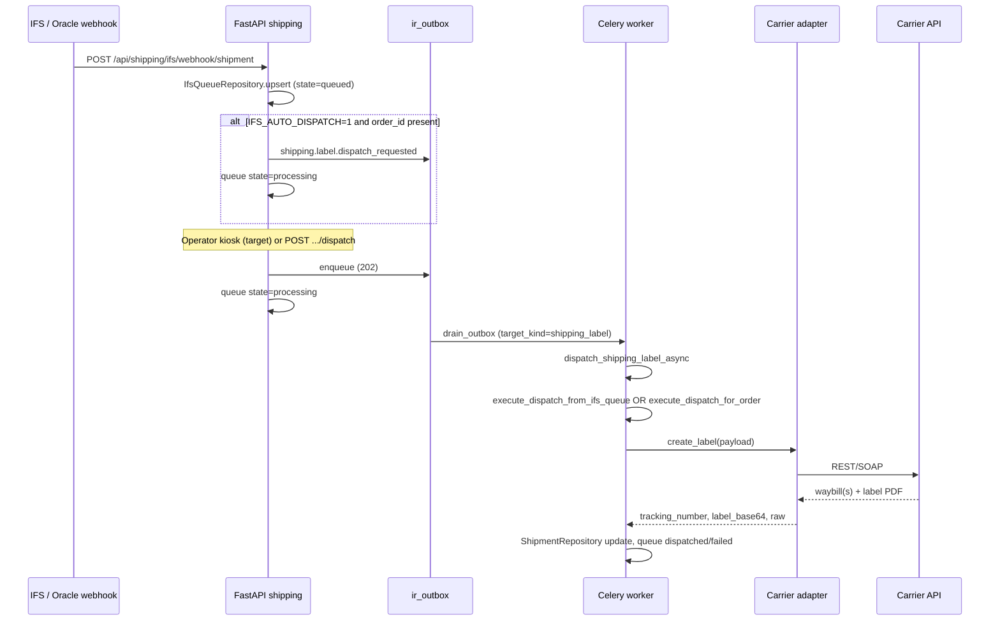

# Carrier labels and waybills

> **Module:** `shipping`  
> **Audience:** operators, integrators, AI agents implementing dispatch  
> **Related:** [`spec.md`](./spec.md), [`docs/shipping-dpd-native.md`](../../../../docs/shipping-dpd-native.md), [`docs/shipping-schenker-dsv-native.md`](../../../../docs/shipping-schenker-dsv-native.md), [`.env.shipping.example`](../../../../.env.shipping.example)

This document describes how Orbiteus generates carrier labels (waybills) from IFS logistics data: lifecycle, routing, payload mapping, multi-waybill composition, errors, printing, Celery/outbox, tests, and gaps versus the target kiosk + auto-dispatch design.

---

## 1. Scope and principles

| Principle | Implementation |
|-----------|----------------|
| No carrier HTTP on FastAPI request thread | `POST …/dispatch` and `POST …/ifs/queue/{id}/dispatch` return **202** and insert `ir_outbox` (`target_kind=shipping_label`) |
| One outbox row per **waybill submit** (target) | Today: one row per **dispatch request** (single `shipping.shipment`); multi-waybill kiosk will enqueue **one row per slot** |
| Packaging matrix per carrier | `lib/ifs_packaging.py` (`PACKAGING_MATRIX`) |
| CF$_ handling units | `lib/cf_handling_units_parser.py` → expanded lines → `packages[]` |
| Vendor-neutral repo copy | Carrier names here are integration facts (DPD Poland, DSV/eSchenker, Geodis PUGO), not third-party ERP product references |

**Deployment roles**

- **SECONDARY (Orbiteus):** IFS webhook → queue → optional auto-dispatch or operator kiosk → native adapters.
- **PRIMARY (legacy hub):** May still own labels while `IFS_AUTO_DISPATCH=0`; Orbiteus ingests and queues without calling carriers until explicitly dispatched.

---

## 2. Domain models and states

### 2.1 `shipping.shipment` (`shipping_shipments`)

One row per **label job** today (one carrier API call). Fields used for labels:

| Field | Role |
|-------|------|
| `state` | Lifecycle (see below) |
| `carrier_code` | Canonical: `DPD`, `DSV`, `GEODIS`, `INPOST`, `MOCK` |
| `tracking_number` | Primary waybill / booking id returned by carrier |
| `label_payload_json` | JSON blob: `tracking_number`, `label_base64`, `label_url`, `raw` |
| `error_message` | Operator-visible failure |
| `weight_kg`, `is_pallet`, `is_locker`, `forward_agent_id` | Routing inputs |

**Shipment states** (`model/domain.py`):

```
draft → queued → label_created → dispatched → delivered
                    ↘ failed
                    ↘ cancelled
```

| State | Meaning |
|-------|---------|
| `queued` | Row created; worker about to call adapter (set in `execute_dispatch_for_order` before HTTP) |
| `label_created` | Adapter succeeded; `label_payload_json` populated |
| `failed` | Config missing, validation error, or carrier error caught in service layer |
| `dispatched` / `delivered` | Downstream logistics (not fully wired in v0.2) |

### 2.2 `shipping.ifs_queue` (`shipping_ifs_shipment_queue`)

Inbound IFS shipment snapshot (webhook payload canonicalized to `IfsLogisticsPayload`).

**Queue states:**

```
queued → processing → dispatched
              ↘ failed
```

| State | Set by |
|-------|--------|
| `queued` | Webhook ingest (`ingest_ifs_webhook`) |
| `processing` | Manual/auto dispatch HTTP handler or auto-dispatch after ingest |
| `dispatched` | Worker success (`execute_dispatch_from_ifs_queue` + `label_created`) |
| `failed` | Worker failure |

### 2.3 Target: waybill slots (not in code yet)

For **multi-waybill kiosk**, introduce a child entity (e.g. `shipping.waybill` or slots on queue UI) per operator-composed label:

| Slot field | Purpose |
|------------|---------|
| `slot_index` | 1–5 per IFS shipment |
| `carrier_code` | Per-slot override |
| `handling_unit_refs` | Subset of expanded `lines[]` / HU ids |
| `state` | `draft` → `submitted` → `label_created` / `failed` |
| `shipment_id` | FK to `shipping.shipment` after submit |

Until this exists, one IFS dispatch creates **one** shipment with **all** packages in a single carrier booking.

---

## 3. Label generation lifecycle

### 3.1 End-to-end flow



### 3.2 Outbox event

| Property | Value |
|----------|--------|
| Event | `shipping.label.dispatch_requested` |
| `target_kind` | `shipping_label` |
| `target_ref` | `ifs_shipment_id` when from IFS queue; else optional |

Handler: `tasks/outbox_tasks.py` → `tasks/shipping_tasks.dispatch_shipping_label_async`.

### 3.3 Idempotency

| Layer | Behavior |
|-------|----------|
| **Outbox drain** | Rows claimed with `UPDATE … WHERE status='pending'`; at-most-once per successful `done` |
| **Outbox retry** | On handler exception: exponential backoff (`1m … 1h` cap), max `ORBITEUS_OUTBOX_MAX_RETRIES` (default 10), then `dead` |
| **IFS queue** | `execute_dispatch_from_ifs_queue` raises if `state == dispatched` (no second label for same queue row without reset) |
| **Carrier APIs** | **Not** idempotent today — replays may create duplicate bookings; target: idempotency key = `(tenant_id, ifs_shipment_id, waybill_slot)` in payload + DB unique constraint |
| **DPD** | Single REST session creates N parcels; replay = duplicate waybills unless guarded |

**Stuck processing:** `release_stuck_processing` resets `processing` rows older than `ORBITEUS_OUTBOX_STUCK_TIMEOUT` (default 300s) to `pending`.

### 3.4 Retries

| Error class | Outbox | Shipment / queue | Operator action |
|-------------|--------|------------------|-----------------|
| Transient carrier 5xx / timeout | Retry via outbox | Stay `queued`/`processing` until dead | Wait or re-enqueue after fix |
| Config missing (`carrier_configured` false) | May exhaust retries | `failed` immediately in worker | Fix `.env`, redeploy worker |
| Validation (address, pack type) | Dead after retries | `failed` | Fix IFS/CF data, reset queue, dispatch again |
| Success | `done` | `label_created` / `dispatched` | Print label |

---

## 4. Auto-dispatch vs kiosk (business rules)

### 4.1 Current behavior (v0.2)

| Path | Trigger | Carrier HTTP |
|------|---------|--------------|
| **Manual IFS dispatch** | `POST /api/shipping/ifs/queue/{ifs_shipment_id}/dispatch` + `order_id` | Celery only |
| **API dispatch** | `POST /api/shipping/dispatch` + `DispatchBody` | Celery only |
| **Auto after ingest** | `IFS_AUTO_DISPATCH=1` **and** `order_id` in webhook JSON | Enqueues outbox; **default env is `0`** |
| **Routing preview** | `POST /api/shipping/simulate` | None |

Auto-dispatch does **not** open kiosk; it uses the same worker path as manual dispatch (`ifs_shipment_id` in outbox payload).

### 4.2 Target rules (recommended)

Use **kiosk** when any of the following hold:

| Rule | Rationale |
|------|-----------|
| Expanded handling unit count **> 1** after `merge_ifs_payload_lines_with_cf_handling_units` | Operator may split pallets vs parcels across carriers |
| **Mixed** `pallet` + `parcel` unit types in `handling_units_summary` | DPD parcels vs Geodis/DSV pallets often need separate bookings |
| Total weight **≥ `LOGISTICS_HEAVY_KG`** (default 100) **and** light parcels also present | Matrix split: heavy → pallet carrier, light → DPD |
| `forward_agent_id` / `cf_c_przewoznik` **conflicts** with `resolve_carrier_for_shipment()` | Respect explicit carrier vs routing suggestion |
| More than **one** distinct `pack_type` requiring different carrier pack codes | e.g. `PAL_A` + `PACZKASTD` on same shipment |
| Prior dispatch **failed** with validation error | Operator adjusts slot composition |

Use **single-shipment auto** when **all** are true:

| Rule | Rationale |
|------|-----------|
| Exactly **one** handling unit line after expansion (qty folded into one booking or single parcel) | One waybill sufficient |
| Weight **≤ `LOGISTICS_LIGHT_MAX_KG`** (default 30) and not pallet | Route to DPD |
| **Or** single pallet line and weight **≥ `LOGISTICS_HEAVY_KG`** | Route to `LOGISTICS_PALLET_CARRIER` (Geodis or DSV) |
| `LOGISTICS_RESPECT_IFS_AGENT=1` and `forward_agent_id` set | Skip matrix; use agent code |
| Carrier **configured** in env | `GET /api/shipping/carriers/status` |
| `IFS_AUTO_DISPATCH=1` and linked `order_id` | Enables ingest-time enqueue |

**Kiosk UX (target):** 1–5 **slots** per `ifs_shipment_id`; each slot = carrier + subset of HUs + optional `force_carrier`; each **Submit** = one outbox row → one `shipping.shipment`.

### 4.3 Routing reference (`lib/routing.py`)

Priority:

1. If `LOGISTICS_RESPECT_IFS_AGENT=1` and `forward_agent_id` → normalize via `carrier_registry` (`DSV`, `GEODIS`, `DPD`, …).
2. If `is_locker` → `INPOST`.
3. If `is_pallet` **or** `weight_kg >= LOGISTICS_HEAVY_KG` → `LOGISTICS_PALLET_CARRIER` (`geodis` → `GEODIS`, `schenker`/`dsv` → `DSV`).
4. If `0 < weight_kg <= LOGISTICS_LIGHT_MAX_KG` → `DPD`.
5. Default → `DPD`.

`execute_dispatch_from_ifs_queue` sets `is_pallet` from **first line only** (`is_pallet(first_pack)` — gap for mixed loads).

---

## 5. Payload mapping: handling units → adapter parcels

### 5.1 Pipeline

```
IFS webhook JSON
  → build_logistics_payload_from_ifs_webhook (ifs_inbound_mapper)
      → parse_cf_handling_units / merge_ifs_payload_lines_with_cf_handling_units
      → IfsLogisticsPayload.lines[]
  → payload_to_dispatch_packages
      → packages[] { pack_type, quantity, weight_kg, dimensions, source_line_index }
  → payload_to_ifs_dispatch_dict → ifs_payload
  → DispatchBody(ifs_payload, packages, weight_kg, forward_agent_id, …)
  → adapter._build_request_from_dispatch
      → build_shipment_request_from_ifs (ifs_mapper)
          → ParcelInfo[] with resolve_carrier_pack_type per carrier
  → carrier client (REST/SOAP)
```

### 5.2 CF$_ → IFS pack codes (`cf_handling_units_parser.py`)

| CF key family | IFS `pack_type` | `type` |
|---------------|-----------------|--------|
| `cf_p_a` … `cf_p_y`, `cf_paleta_*` | `PAL_A` … `PAL_Y` | `pallet` |
| `cf_paczkaastd`, `cf_paczkastd` | `PACZKASTD` | `parcel` |
| `cf_paczkaanst`, … | `PACZKANST` | `parcel` |
| `cf_dluzyca*` | `DLUZYCA` | `parcel` |

`expand_handling_units_to_lines` expands `qty` into one line per physical unit.

**Merge policy:**

- CF units present, IFS lines **without** `pack_type` → CF lines replace.
- Both present → **concatenate** (IFS lines + CF expanded lines).

### 5.3 Packaging matrix (`ifs_packaging.py`)

Example mappings (IFS → carrier code):

| IFS `pack_type` | DSV | Geodis | DPD |
|-----------------|-----|--------|-----|
| `PACZKASTD` | `PC` | `PC` | `PARCEL` |
| `PAL_A` | `EP` | `EUR` | `PALLET` |
| `PAL_G` | `XPP2` | `PLPAL` | `HALF_PALLET` |

`resolve_carrier_pack_type(carrier_code, ifs_pack_type)` uses `CARRIER_ALIAS` (`SCHENKER`→`dsv`, `PEKAES`→`geodis`).

Weight on parcels: `_expand_parcels` distributes **content weight** = `total_weight_kg - sum(tare)` across units.

### 5.4 Per-carrier adapter behavior

#### DPD Poland (`DpdPythonAdapter` → `DpdCarrier`)

| Step | API | Notes |
|------|-----|-------|
| Booking | REST `generatePackagesNumbers` | One request, **N parcels** → N waybills in `raw.waybills` |
| Labels | SOAP `generateSpedLabelsV4` | **Second call**; all waybills in one SOAP session → single PDF (typical) |
| Tracking | First waybill in `tracking_number` | Full list in `raw.waybills` |
| Sender | IFS contract `BIS`/`CIE`/`BAZ` → `ifs_dispatch_profiles` or `DPD_SENDER_*` env |

Parcel mapping: `ParcelInfo` → REST `parcels[]` (`weight`, `sizeX/Y/Z`, `customerData1` reference).

#### DSV / DB Schenker (`DsvPythonAdapter` → `DsvCarrier`)

| Step | API | Notes |
|------|-----|-------|
| Booking | SOAP `getBookingRequestLand` | `DsvShipmentPosition` per parcel; `pack_type` from matrix |
| Label | Inline `barcodeDocument` or `getBookingBarcodeRequest` | A6 PDF base64 |
| Pickup | `options.pickupLocation` from IFS contract profile | SHIPPER vs PICKUP addresses per native doc |
| Pickup window | `next_dsv_pickup_window()` | Next business day 09:00–17:00 |

#### Geodis (`GeodisPythonAdapter` → `GeodisCarrier`)

| Step | API | Notes |
|------|-----|-------|
| Booking | SOAP `AddShipment` | Pallet symbols via `resolve_geodis_package_symbol` / `GEODIS_PALLET_DEFINITIONS` |
| Label | `RequestShipmentLabel` + poll | Retries (`GEODIS_LABEL_MAX_RETRIES`); waybill `PL\d{10,20}` |
| Service | `srv_code` default `ST` for pallets (`is_pallet` in adapter) | |

### 5.5 Direct API dispatch (no IFS queue)

`DispatchBody` may include:

- `recipient`, `parcels[]` — manual parcels;
- `ifs_payload` + `packages` — same mapper as IFS path;
- `force_carrier` — bypasses routing.

---

## 6. Multi-waybill scenarios

### 6.1 Same carrier, multiple physical units (implemented)

| Carrier | Behavior |
|---------|----------|
| **DPD** | One REST booking, multiple waybills, one SOAP label PDF for all |
| **DSV** | One booking, multiple `ShipmentPosition` lines, one barcode PDF |
| **Geodis** | One `AddShipment` with multiple pallet/parcel elements (per client XML) |

### 6.2 Split pallets / mixed parcel+pallet (target kiosk)

| Scenario | Target handling |
|----------|-----------------|
| 2× `PAL_A` + 3× `PACZKASTD` | Slot 1: Geodis/DSV with 2 EP/EUR lines; Slot 2: DPD with 3 PARCEL lines |
| Same carrier, operator wants **one label per pallet** | Multiple slots, same `carrier_code`, each slot `quantity=1` lines |
| Different carriers per slot | Slot 1 `DSV`, slot 2 `DPD` — **two outbox rows**, two `shipping.shipment` rows |
| Partial failure | Per-slot `failed`; queue stays `processing` until all slots terminal or operator cancels |

### 6.3 Same IFS shipment, different carriers (target)

Not supported in one `create_label` call. Requires **decomposed `packages[]` per slot** and separate worker executions.

---

## 7. Error taxonomy and operator recovery

### 7.1 Exception type

`CarrierIntegrationError(carrier_code, message)` — raised by native clients; wrapped in `execute_dispatch_for_order` as `shipment.state=failed`.

### 7.2 Categories

| Category | Examples | HTTP (API) | Recovery |
|----------|----------|------------|----------|
| **Config** | Missing `DSV_ACCESS_KEY`, `DPD_LOGIN`, `GEODIS_SHIPPER_ID` | 202 queued; worker → `failed` | Set env on worker host; `carrier_configured` check |
| **Validation** | DPD invalidFields, DSV FAT pack type 126, bad postal code | `failed` | Fix payload; re-dispatch queue row (needs state reset from `failed` → `queued` — manual DB/UI today) |
| **Carrier business** | DPD `status != OK`, Geodis no waybill regex match | `failed` | Read `error_message` + `label_payload_json.raw` |
| **Carrier 5xx / network** | `httpx` errors, SOAP faults | Outbox retry → `dead` | Retry outbox or new dispatch after carrier recovery |
| **Logic / state** | Queue already `dispatched` | Worker exception | Do not re-dispatch; create new shipment/slot if business allows |

### 7.3 Operator checklist

1. `GET /api/shipping/carriers/status` — credentials present on **worker**.
2. `GET /api/shipping/ifs/queue?state=failed` — read `error_message`.
3. Inspect `payload_json` / `handling_units_summary` for CF merge issues.
4. `POST /api/shipping/simulate` with weight/pallet/agent flags — compare routing.
5. Fix env or IFS data; reset queue state if needed; `POST …/dispatch` again.
6. For DPD label without PDF: check SOAP logs — REST may succeed while SOAP fails (warning logged in client).

---

## 8. Print and download

### 8.1 Storage today

| Artifact | Location |
|----------|----------|
| Label PDF (base64) | `shipping_shipments.label_payload_json` → `label_base64` |
| Label URL | `label_url` — may be `data:application/pdf;base64,…` or carrier tracking URL |
| Raw carrier response | `label_payload_json.raw` — waybill lists, session ids |

**Gap:** No `ir_attachment` row yet; admin UI should decode `label_base64` client-side or via future download endpoint.

### 8.2 DPD two-step label

1. REST → waybill number(s).
2. SOAP `generateSpedLabelsV4` → PDF bytes (base64).

If SOAP fails after REST success, shipment may have `tracking_number` but weak label data — operator may re-fetch labels via carrier tools until **label reprint API** exists.

### 8.3 DSV / Geodis

- DSV: PDF often inline in booking response (`label_base64`).
- Geodis: async label generation with polling (`download_label`).

### 8.4 Print flow (target UI)

1. List waybills for `ifs_shipment_id` (slots or `raw.waybills`).
2. Decode base64 → `Blob` → browser print or ZPL send.
3. Optional server endpoint: `GET /api/shipping/shipments/{id}/label.pdf` (RBAC, no secrets in URL).

---

## 9. Environment variables

Reference: [`.env.shipping.example`](../../../../.env.shipping.example). Never commit secrets.

### 9.1 Logistics routing

| Variable | Default | Purpose |
|----------|---------|---------|
| `LOGISTICS_PALLET_CARRIER` | `geodis` | `geodis` or `schenker`/`dsv` for heavy/pallet |
| `LOGISTICS_HEAVY_KG` | `100` | Pallet carrier threshold |
| `LOGISTICS_LIGHT_MAX_KG` | `30` | DPD light parcel threshold |
| `LOGISTICS_RESPECT_IFS_AGENT` | `1` | Honor `forward_agent_id` / CF carrier |

### 9.2 Native adapter toggles

| Variable | Default | Purpose |
|----------|---------|---------|
| `SHIPPING_DPD_NATIVE` | `1` | `1` = Python DPD; `0` = legacy hub adapter |
| `SHIPPING_DSV_NATIVE` | `1` | Python DSV/Schenker |
| `SHIPPING_GEODIS_NATIVE` | `1` | Python Geodis |

### 9.3 DPD Poland

| Variable | Required | Notes |
|----------|----------|-------|
| `DPD_LOGIN` | yes | Basic auth |
| `DPD_PASSWORD` | yes | |
| `DPD_MASTER_FID` | yes | Header `X-DPD-FID` |
| `DPD_FID` | no | Payer FID; defaults to master |
| `DPD_ENV` | no | `test` / `prod` |
| `DPD_ENDPOINT` | no | REST base override |
| `DPD_SOAP_URL` | no | Label SOAP override |
| `DPD_LABEL_FORMAT` | no | `PDF` |
| `DPD_SENDER_*` | no | Fallback sender when no IFS contract profile |

### 9.4 DSV / DB Schenker

| Variable | Required | Notes |
|----------|----------|-------|
| `DSV_ACCESS_KEY` | yes | SOAP applicationArea |
| `DSV_ENV` | no | `test` → FAT |
| `DSV_GROUP_ID`, `DSV_USER_ID` | no | Override pickup profile |
| `DSV_DEFAULT_LOCATION` | no | `bielsko` |
| `DSV_INCOTERM`, `DSV_PRODUCT_CODE`, `DSV_VAT_NO` | no | Booking defaults |
| `DSV_INTERNATIONAL_GROUP_ID` | no | Non-PL destination |

### 9.5 Geodis

| Variable | Required | Notes |
|----------|----------|-------|
| `GEODIS_SHIPPER_ID` | yes | |
| `GEODIS_PASSWORD` | yes | |
| `GEODIS_ENDPOINT`, `GEODIS_SOAP_NS` | no | PUGO gateway |
| `GEODIS_SRV_CODE`, `GEODIS_*_SENDER_*` | no | |
| `GEODIS_LABEL_MAX_RETRIES` | no | Label poll |
| `GEODIS_TEST_SKIP_LABEL` | no | Booking-only smoke |

### 9.6 IFS webhook (SECONDARY)

| Variable | Default | Purpose |
|----------|---------|---------|
| `IFS_WEBHOOK_ENABLED` | `1` | `503` when disabled |
| `IFS_WEBHOOK_SECRET` | — | Optional HMAC |
| `IFS_WEBHOOK_ALLOWLIST` | — | Oracle source IPs (CSV) |
| `IFS_AUTO_DISPATCH` | `0` | Auto-enqueue on ingest |

### 9.7 Outbox (platform)

| Variable | Default | Purpose |
|----------|---------|---------|
| `ORBITEUS_OUTBOX_BATCH` | `50` | Drain batch size |
| `ORBITEUS_OUTBOX_MAX_RETRIES` | `10` | Before `dead` |
| `ORBITEUS_OUTBOX_STUCK_TIMEOUT` | `300` | Release stuck `processing` |

### 9.8 Module config (`ir_config_param`)

| Key | Purpose |
|-----|---------|
| `shipping.ifs_tenant_slug` | Tenant for `actor=system` webhook ingest |

---

## 10. Celery task design

### 10.1 Current handler

`dispatch_shipping_label_async(event, payload, target_ref)` in `tasks/shipping_tasks.py`.

**Branches:**

| `payload` keys | Worker function |
|----------------|-----------------|
| `ifs_shipment_id` + `order_id` | `execute_dispatch_from_ifs_queue` |
| `dispatch_body` | `execute_dispatch_for_order(DispatchBody)` |
| else | `ValueError` |

### 10.2 Target: `execute_dispatch_for_waybill`

Split from monolithic IFS dispatch so **one outbox row = one label job**.

**Proposed payload schema** (`shipping.label.dispatch_requested`):

```json
{
  "tenant_id": "3fa85f64-5717-4562-b3fc-2c963f66afa6",
  "source": "kiosk",
  "ifs_shipment_id": "9001234567",
  "order_id": "7c9e6679-7425-40de-944b-e07fc1f90ae7",
  "waybill_slot": 2,
  "force_carrier": "DPD",
  "dispatch_body": {
    "order_id": "7c9e6679-7425-40de-944b-e07fc1f90ae7",
    "weight_kg": 12.5,
    "is_pallet": false,
    "is_locker": false,
    "forward_agent_id": "DPD",
    "force_carrier": "DPD",
    "ifs_payload": {
      "shipment_id": "9001234567",
      "order_no": "SO-10042",
      "contract": "BIS^01",
      "total_weight_kg": 45.0,
      "destination": { "company_name": "…", "line1": "…", "city": "…", "postal_code": "…", "country_code": "PL" }
    },
    "packages": [
      {
        "pack_type": "PACZKASTD",
        "quantity": 1,
        "weight_kg": 0.3,
        "length_cm": 40,
        "width_cm": 40,
        "height_cm": 100,
        "source_line_index": 0
      }
    ]
  }
}
```

**Idempotency:** `target_ref` = `{ifs_shipment_id}:{waybill_slot}`; unique index on `(tenant_id, target_ref)` for active shipments.

**Queue completion:** When all slots for `ifs_shipment_id` are `label_created` or terminal failure, set `ifs_queue.state=dispatched` (or `partial_failed`).

### 10.3 Worker requirements

```bash
celery -A celery_app worker -l info -Q default,outbox
celery -A celery_app beat -l info   # drain_outbox schedule
```

---

## 11. Test strategy

### 11.1 Unit tests (no carrier HTTP)

| Area | Command / file |
|------|----------------|
| CF parser | `pytest backend/tests/test_ifs_cf_parser.py` |
| DPD XML/body builders | `pytest backend/tests/test_dpd_native.py` |
| DSV builders | `pytest backend/tests/test_dsv_native.py` (if present) |
| Outbox enqueue shape | `pytest backend/tests/test_ifs_outbox_dispatch.py` |
| Webhook route | `pytest backend/tests/test_ifs_webhook_route.py` |

**Mock adapter:** `MockCarrierAdapter` — register via `force_carrier=MOCK` or routing to MOCK when configured; returns fake `tracking_number` without HTTP.

**Patch pattern:** `@patch` `adapter_for` or `enqueue` in service tests (see `test_ifs_outbox_dispatch.py`).

### 11.2 Integration tests

`test_ifs_webhook_integration.py` — DB + webhook ingest (no live carrier).

### 11.3 Smoke scripts (FAT/test credentials only)

| Carrier | Script |
|---------|--------|
| DPD | `python backend/scripts/dpd_orbiteus_smoke.py [N]` |
| DSV | `python backend/scripts/dsv_orbiteus_smoke.py` |

Require env on **same host as worker**; write PDFs to cwd for visual check.

### 11.4 Recommended additions

- Golden tests: `payload_to_dispatch_packages` + `build_shipment_request_from_ifs` per fixture JSON.
- Multi-slot kiosk: API tests enqueue **N** outbox rows with distinct `target_ref`.
- Idempotency: duplicate drain must not create second `tracking_number` when slot already `label_created`.

---

## 12. Gaps: current code vs target

| Target | Current state |
|--------|----------------|
| Multi-waybill kiosk (1–5 slots per IFS shipment) | **Not implemented** — no UI, no `waybill_slot`, no per-slot model |
| One outbox row per waybill submit | **One row per dispatch request** — entire queue row → one shipment |
| Auto-dispatch only when single-shipment rules pass | **Binary `IFS_AUTO_DISPATCH`** — no HU-count / mixed-type checks |
| `execute_dispatch_for_waybill` | **Missing** — only `execute_dispatch_for_order` / `execute_dispatch_from_ifs_queue` |
| `is_pallet` from whole shipment | **First line only** in IFS dispatch |
| `label_base64` → `ir_attachment` | **JSON column only** |
| Label reprint / DPD SOAP-only retry | **Not exposed** |
| Idempotent carrier replay | **Not implemented** |
| INPOST / GLS native adapters | **Registry only** — `NotImplementedError` or hub fallback |
| Queue `failed` → re-dispatch without manual state reset | **No API** — operator must use DB or future “retry” action |
| Mercato PRIMARY coexistence | Documented; `IFS_AUTO_DISPATCH=0` by default |
| Geodis env in `.env.shipping.example` | Minimal — extend with `GEODIS_SENDER_*`, retry knobs |

---

## 13. File map

| Concern | Path |
|---------|------|
| HTTP + enqueue | `controller/services.py`, `controller/router.py` |
| IFS webhook | `controller/ifs_webhook_router.py` |
| Outbox worker | `tasks/shipping_tasks.py`, `tasks/outbox_tasks.py` |
| Routing | `lib/routing.py` |
| CF / HU | `lib/cf_handling_units_parser.py` |
| Packaging matrix | `lib/ifs_packaging.py` |
| IFS → packages | `lib/ifs_inbound_mapper.py` |
| IFS → ShipmentRequest | `lib/ifs_mapper.py` |
| Adapters | `lib/adapters/{dpd,dsv,geodis}_adapter.py`, `lib/carrier_registry.py` |
| DPD SOAP labels | `lib/adapters/dpd/soap_labels.py` |
| Domain | `model/domain.py`, `model/schemas.py` |

---

## 14. Related documentation

- Module contract: [`spec.md`](./spec.md)
- DPD native: [`docs/shipping-dpd-native.md`](../../../../docs/shipping-dpd-native.md)
- DSV native + IFS SECONDARY: [`docs/shipping-schenker-dsv-native.md`](../../../../docs/shipping-schenker-dsv-native.md)
- Platform outbox: `docs/pre-prompt.md` §7, `tasks/outbox_tasks.py`
