# Formatka mixu paletowego — port z swift-ship-composer do Orbiteus

> **Źródło UX (prototyp):** https://github.com/msulich7-hub/swift-ship-composer  
> **Docelowe miejsce:** moduł `shipping` w **msulich7-hub/orbiteus** (nie osobna aplikacja Vite)  
> **Status:** plan wdrożenia (v0.3 kiosk już pokrywa ~70% logiki)

## Odpowiedź w skrócie

**Tak** — formatkę mixu paletowego / paczek można zrobić na wzór **swift-ship-composer**, pod warunkiem że:

1. **Nie kopiujemy** osobnego stacku (Vite + TanStack Router + shadcn + Zustand mock).
2. **Rozszerzamy** istniejący kiosk Orbiteus: `ShpKioskComposer` + API `compose-preview` / `dispatch`.
3. **Dane** pochodzą z IFS (`CF$_` / handling units), nie z hardcoded `BLOCKS[]`.
4. **Etykiety** idą przez Celery + outbox (jak dziś), nie „Generate lists” w przeglądarce.

W praktyce **swift-ship-composer = mockup UI**; **Orbiteus shipping v0.3 = produkcyjna wersja** tej samej idei, zgodna z `docs/pre-prompt.md` i ADR Orbiteus.

---

## Mapowanie pojęć

| swift-ship-composer | Orbiteus (już jest / docelowo) |
|---------------------|--------------------------------|
| `Block` (carton S/M/L, EUR pallet, …) | `ShpHandlingUnit` z IFS (`PAL_*`, `PACZKA*`, qty, waga) |
| Lewy panel „Building blocks” | Pula jednostek w kiosku (`hu-pool`) + sekcje Paczki / Palety |
| `ShipmentZone` (max 3 strefy) | `ShpWaybillColumn` (max **5** listów) |
| Przeciągnięcie bloku → strefa | DnD tile → kolumna waybill (`@dnd-kit`, Mantine) |
| `CarrierChip` → strefa | Kurier na waybill + `carrier_registry` (DPD/DSV/GEODIS) |
| `Generate lists` (dialog) | `POST …/dispatch` → outbox → `shipping_tasks` → PDF/ZPL |
| `useShipments` (Zustand, local) | `kiosk_services` + Postgres (`dispatch`, `waybill`, `handling_unit`) |
| Standalone URL `/` | `/shipping/ifs_queue?kiosk={ifs_shipment_id}` |

---

## Co już mamy w Orbiteus (nie budować od zera)

| Element | Ścieżka |
|---------|---------|
| Kiosk DnD | `admin-ui/src/components/shipping/ShpKioskComposer.tsx` |
| Kafelki HU | `ShpHandlingUnitTile.tsx` |
| Kolumny listów | `ShpWaybillColumn.tsx` |
| Inbox IFS | `ShpIfsInboxPage.tsx` |
| Preview AUTO/kiosk | `compose_preview.py`, `useShpComposePreview.ts` |
| Backend workspace | `kiosk_services.py`, `router.py` |
| Spec UX | `docs/ux-kiosk.md` |

**Test na VM:** http://10.10.99.60:3020/shipping/ifs_queue

---

## Co warto **przenieść** z swift-ship-composer (tylko UX)

Bez zmiany architektury Orbiteus — inspiracja wizualna i ergonomia:

| Feature w prototypie | Propozycja w Orbiteus |
|--------------------|------------------------|
| 3-kolumnowy layout (bloki \| strefy \| kurierzy) | Opcjonalny layout w `ShpKioskComposer` (Mantine `Grid`) |
| Podział **Cartons / Pallets** w lewym panelu | Grupowanie `pool` po `unit.type` / `pack_type` |
| Ikony typów (carton-s, pallet-eur, tube…) | Mapowanie `pack_type` → `ThemeIcon` / kolor (jak `BlockIcon`) |
| Sumy kg / szt. w nagłówku strefy | Rozszerzyć `ShpWaybillColumn` o `totals` z API |
| Animacje wejścia stref | Framer **nie** w stacku Orbiteus — Mantine transitions wystarczą |
| Przycisk „Generate lists” | PL: **„Wyślij do kuriera”** → istniejący flow dispatch |
| Max 3 shipments | Zostawiamy **max 5** (spec MDM multi-waybill) |

**Nie przenosimy:** shadcn, `lucide` jako system ikon (zostaje Tabler + Mantine), dark mode toggle w kiosk (opcjonalnie później przez Mantine).

---

## Zasady Orbiteus (twardy checklist)

| Zasada | Implementacja mixu |
|--------|------------------|
| Moduł w `modules/shipping/` | manifest, domain, mapping, router, security YAML |
| UI w `admin-ui/.../shipping/` | bez `app/shipping/*` — wire z `[module]/[model]/page.tsx` |
| API przez `/api` proxy + cookie | `api.get/post` z `withCredentials` |
| RBAC | `security/access.yaml` na dispatch/waybill/kiosk endpoints |
| Audit | CRUD + dispatch actions |
| Kurierzy async | Celery `execute_dispatch_for_waybill`, nie HTTP z UI |
| Multi-tenant | `BaseRepository` + `RequestContext` |
| IFS jako źródło HU | `cf_handling_units_parser`, `compose-preview` — nie mock `BLOCKS` |
| Testy | pytest compose/dispatch + opcjonalnie Playwright na `?kiosk=` |

---

## Proponowane taski (SHP-T25+)

| ID | Opis | Effort |
|----|------|--------|
| SHP-T25 | Lewy panel: grupy Paczki / Palety + ikony pack_type (wzór `PaletteTile`) | M |
| SHP-T26 | Nagłówki waybill: suma kg, liczba HU, walidacja max wagi | S |
| SHP-T27 | Layout 3-kolumnowy (pool \| waybills \| pasek kurierów) | M |
| SHP-T28 | Podgląd PDF etykiet po dispatch (link z waybill) | M |
| SHP-T29 | Playwright: inbox → kiosk → DnD → mock dispatch | L |

Zależności: v0.3 (**merged PR #2**) + dane w kolejce IFS na TEST.

---

## Architektura (docelowa)

```mermaid
flowchart LR
  IFS[IFS webhook] --> Queue[shipping_ifs_shipment_queue]
  Queue --> Inbox[ShpIfsInboxPage]
  Inbox --> Preview[compose-preview API]
  Preview --> Kiosk[ShpKioskComposer DnD]
  Kiosk --> Save[PUT dispatch plan]
  Save --> Dispatch[POST dispatch]
  Dispatch --> Outbox[orbiteus_outbox]
  Outbox --> Worker[Celery shipping_tasks]
  Worker --> Carrier[DPD DSV Geodis]
```

UI mixu = warstwa **Kiosk**; swift-ship-composer pokazuje tylko warstwę środkową bez IFS i bez outbox.

---

## Anti-patterns (czego nie robić)

- ❌ Embedować swift-ship-composer jako iframe / osobny port :3xxx  
- ❌ Kopiować `shipment-store.ts` zamiast API Orbiteus  
- ❌ Wywoływać DPD/DSV z przeglądarki (łamie CLAUDE.md / Mercato flow)  
- ❌ Nowy moduł `mix` obok `shipping` — to ten sam bounded context  
- ❌ Osobny repo deploy — wszystko w **orbiteus** `main`

---

## Referencje w repo

| Repo / plik | Rola |
|-------------|------|
| [swift-ship-composer](https://github.com/msulich7-hub/swift-ship-composer) | Prototyp UX (Lovable) |
| `ShipmentMixBuilder.tsx` | Layout + DnD wzorzec |
| `ux-kiosk.md` | Kontrakt UI Orbiteus |
| `carrier-labels.md` | Cykl życia listu |
| `docs/operations/vm-mdm-nt.md` | Deploy VM |

---

## Następny krok (rekomendacja)

1. Operator testuje obecny kiosk: `/shipping/ifs_queue` na VM.  
2. Z listy SHP-T25..T27 wybieramy **jeden** sprint UX (layout 3-col + grupy palet).  
3. PR tylko w `msulich7-hub/orbiteus` — branch `feat/shipping-mix-ui`.
